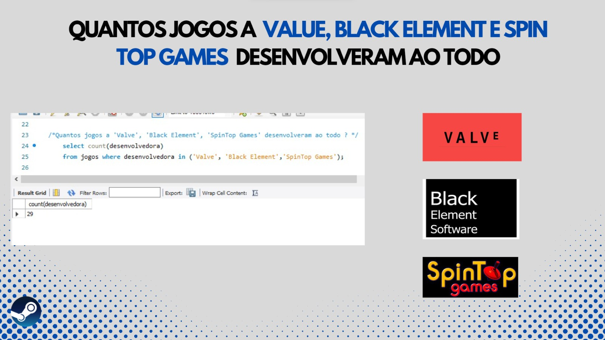

# Bem vindo ! Aqui aprenderemos alguns comandos e e dicas do MySql.

## Vamos separar nosso trabalho passo a passo , para que você possa compreender de maneira fácil.
***
## 1º passo - Análisar a Tabela do excel que será transformada para o Formato CSV.

- [x] jogo
- [x] lancamento
- [x] desenvolvedor
- [x] plataforma
- [x] categoria
- [x] genero
- [x] conquistas
- [x] avPositivas
- [x] avNegativas
- [x] mediajogo
- [x] preco

### os cabeçalhos listados acima serão muito importantes na criação do banco dados
### importante informar que não usaremos o cabeçalho "editora".

 

 

***
## 2º Passo - transformar a tabela do excel em formato.csv

Na planilha do excel , no canto superior esquerdo , clique em arquivo e depois salvar como:

salve o arquivo como " .csv(separado por vírgula)", assim como mostra a imagem a seguir

***

## 3º Passo -  Criando o banco de dados "testeProjeto".

vamos utilizar os cabeçalhos que vimos anteriormente para a criação da estrutura do banco.

Note que não utilizaremos o cabeçalho 'id' e 'editora', não vamos utiliza-los em nosso banco.

temos o código de criação do banco de dados:

    create database testeProjeto;

devemos informar ao "mysql workbench" que a partir de agora iremos usar o banco "testeProjeto":

e para isso temos o comando "use".

    use testeProjeto;

Agora temos nosso banco criado e estamos usando o mesmo, o código de criação da estrutura do banco

segue na imagem abaixo:

#### Ressaltamos novamente que não iremos utilizar a "editora".

***

## 4º Passo - Importando o arquivo CSV.

No canto esquerdo da tela do "mysql workbench", temos nossa tabela "jogos" dentro do banco "testeProjeto".

clique com botão direito do mouse na tabela jogos, e depois em "table data import Wizard".

### clique em "Browse.." e selecione a planilha em formato.csv.

***

# ATENÇÃO!!! Desmarque a opção editora , marque a opção jogo e mude de 'id' para jogo no campo ao lado.
## O 'id' é criado automaticamente no banco de dados , por isso não precisamos utiliza-lo aqui.

Em seguida , clique em next até o final.

 

 

***

## Ao final você terá os registros incluídos a sua tabela jogos.

***
  

# Agora irei adicionar algumas imagens com comandos de manipulação de dados para que te ajude futuramente! 
  

    comando:
        select nome, max(preco), lancamento from jogos;

  

***
  

    comando:
        select id, nome from jogos where id <= 10;

  

***
  

    comando:
        select nome, avNegativa from jogos where avNegativa order by desc limit 5;

  

***
  

    comando:
        select nome, desenvolvedora, categoria, avPositiva from  jogos where avPositiva order by avPositiva desc limit 5;

  

***
  

    comando:
        select nome, conquista from jogos where conquista order by conquista desc limit 5;

  

***

  

    comando:
        select count(desenvolvedora) from jogos where desenvolvedora in ('Valve', 'Black Element', 'SpinTop Games');
    
    O comaando 'in' é utilizado quando precisamos passar mais de 1 parâmetro, se necessitarmos de apenas 1 parâmetro, usariamos
    o comando 'like' ao invés de 'in'.
    ex:
        select count(desenvolvedora) from jogos where desenvolvedora like 'Valve';

